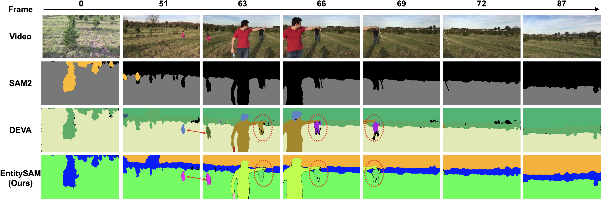
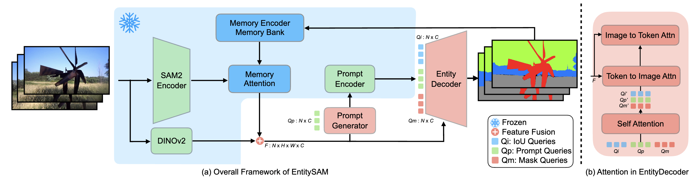

# EntitySAM [CVPR'25]

> [**EntitySAM: Segment Everything in Video**](https://openaccess.thecvf.com/content/CVPR2025/papers/Ye_EntitySAM_Segment_Everything_in_Video_CVPR_2025_paper.pdf2)                 
> CVPR 2025  
> Adobe Research, EPFL, CMU

We propose **EntitySAM**, a novel framework extending SAM2 to the task of **Video Entity Segmentation**—segmenting every entity in a video without requiring category annotations. Our method achieves generalizable and exhaustive segmentation using **only image-level training data**, and demonstrates strong **zero-shot** performance across multiple benchmarks. Refer to our [paper](https://openaccess.thecvf.com/content/CVPR2025/papers/Ye_EntitySAM_Segment_Everything_in_Video_CVPR_2025_paper.pdf) for more details.



Updates
-----------------
The code will be released soon in two weeks.

2025/06/02: Our paper [EntitySAM](https://openaccess.thecvf.com/content/CVPR2025/papers/Ye_EntitySAM_Segment_Everything_in_Video_CVPR_2025_paper.pdf) is online.

# Introduction
Automatically tracking and segmenting every video entity remains a significant challenge. Despite rapid advancements in video segmentation, even state-of-the-art models like SAM 2 struggle to consistently track all entities across a video—a task we refer to as Video Entity Segmentation. We propose EntitySAM, a framework for zero-shot video entity segmentation. EntitySAM extends SAM 2 by removing the need for explicit prompts, allowing automatic discovery and tracking of all entities, including those appearing in later frames. We incorporate query-based entity discovery and association into SAM 2, inspired by transformer-based object detectors. Specifically, we introduce an entity decoder to facilitate inter-object communication and an automatic prompt generator using learnable object queries. Additionally, we add a semantic encoder to enhance SAM 2’s semantic awareness, improving segmentation quality. Trained on image-level mask annotations without category information from the COCO dataset, EntitySAM demonstrates strong generalization on four zero-shot video segmentation tasks: Video Entity, Panoptic, Instance, and Semantic Segmentation. Results on six popular benchmarks show that EntitySAM outperforms previous unified video segmentation methods and strong baselines, setting new standards for zero-shot video segmentation.

# Method Overview
**(a) Overview of the EntitySAM framework**: EntitySAM utilizes the frozen encoder and memory parameters from SAM 2, incorporating a dual encoder design for enhanced semantic features. The PromptGenerator automatically generates prompts from Prompt Queries. The enhanced features and distinct query groups are processed by the EntityDecoder to produce video mask outputs. 

**(b) EntityDecoder** Self-attention and cross-attention mechanisms in EntityDecoder layers.



# Visualizations

## Zero-shot Video Entity Segmentation
Our EntitySAM segment every entity in a video. Results are compared with SAM 2 and DEVA. EntitySAM achieves zero-shot video entity segmentation without requiring  video-level training data or category annotations.

<video width="100%" controls>
  <source src="./assets/example1.mp4" type="video/mp4">
  Your browser does not support the video tag.
</video>

<video width="100%" controls>
  <source src="./assets/example2.mp4" type="video/mp4">
  Your browser does not support the video tag.
</video>

<video width="100%" controls>
  <source src="./assets/example3.mp4" type="video/mp4">
  Your browser does not support the video tag.
</video>

<video width="100%" controls>
  <source src="./assets/example4.mp4" type="video/mp4">
  Your browser does not support the video tag.
</video>

# Training and Inference
Code will be released soon in two weeks.


Citation
---------------
If you find EntitySAM useful in your research or refer to the provided baseline results, please star :star: this repository and consider citing :pencil::
```
@inproceedings{entitysam,
    title={EntitySAM: Segment Everything in Video},
    author={Ye, Mingqiao and Oh, Seoung Wug and Ke, Lei and Lee, Joon-Young},
    booktitle={CVPR},
    year={2025}
}
```